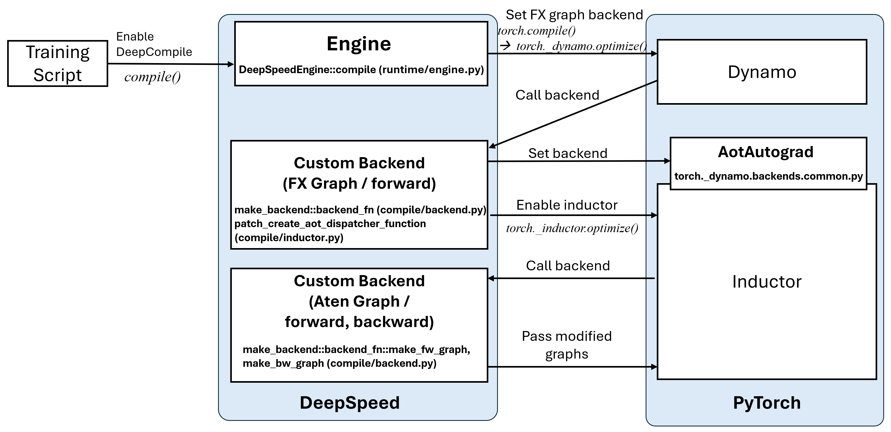
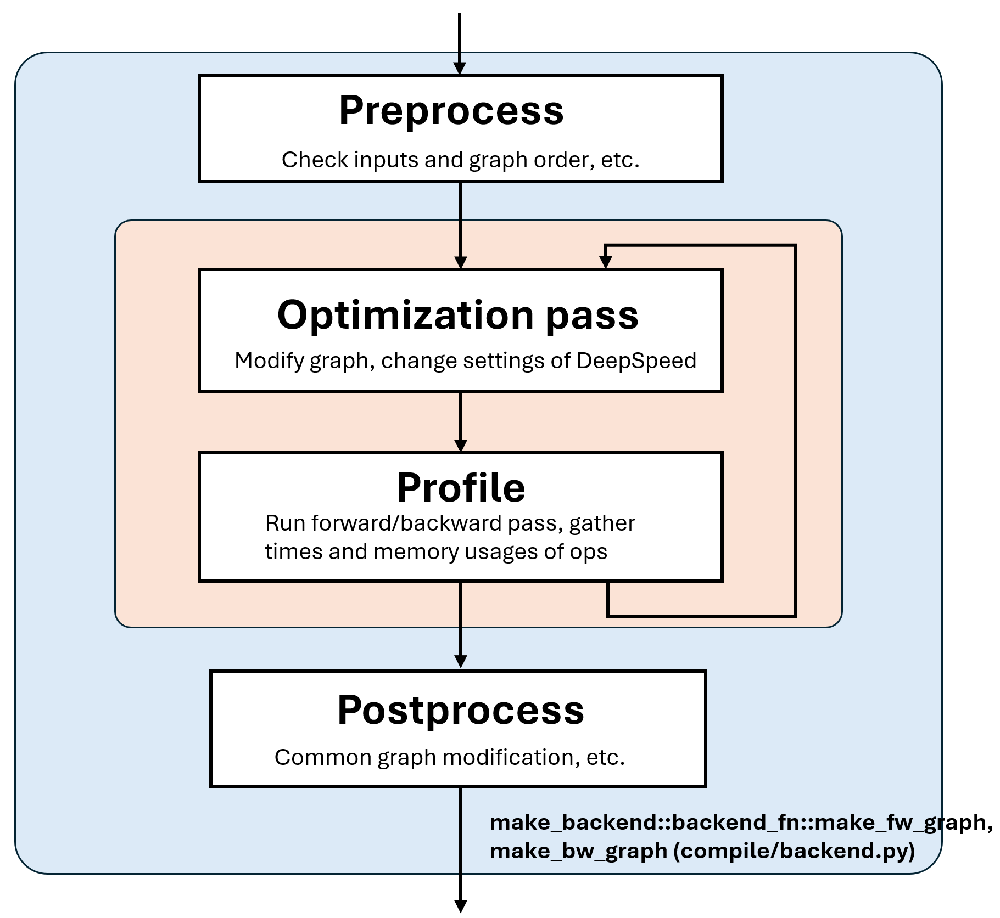

# Design Document: DeepCompile

## 1. Introduction

DeepCompile is a component of DeepSpeed that integrates with the PyTorch compiler (`torch.compile`). It is designed to complement PyTorch’s graph-level optimizations, such as operator fusion and reduced Python overhead, with compiler-level graph transformations tailored for DeepSpeed’s distributed training strategies, including ZeRO and custom communication patterns.

To achieve this, DeepCompile performs runtime profiling to estimate operator-level characteristics such as execution time and memory usage, and rewrites the computation graph accordingly to improve parallelism, memory efficiency, and overall throughput in large-scale training scenarios.

## 2. Module Interaction

The following diagram illustrates the interaction between DeepSpeed Engine, DeepCompile, and the PyTorch (Dynamo, Inductor) compiler stack:

<div align="center">



</div>

The interaction flow is as follows:

1.  **Training Script**: The user's training script enables DeepCompile by calling the `compile()` method of the DeepSpeed engine.
2.  **DeepSpeed Engine (`runtime/engine.py`)**: `compile()` method of the DeepSpeed engine invokes `torch.compile()` passing its initial backend.
3.  **TorchDynamo**: Once a forward pass is called, Dynamo traces the model and calls the backend specified by the DeepSpeed Engine.
4.  **DeepCompile Custom Backend for FX Graph (`compile/backend.py`, `compile/inductor.py`)**:
    * The initial custom backend, defined by `make_backend::backend_fn` in `compile/backend.py`, processes the FX graph primarily for the forward pass.
    * It may involve patching functionalities related to AOT Autograd dispatch, as indicated by `patch_create_aot_dispatcher_function` in `compile/inductor.py`.
    * This backend then sets another backend (for both forward and backward) within the AotAutograd framework.
5.  **AotAutograd (`torch._dynamo.backends.common.py`)**: This PyTorch component handles the generation of forward and backward graphs. It is configured to enable and call DeepCompile's custom backends (forward and backward).
6.  **DeepCompile Custom Backends for Aten Graph (Forward and Backward Pass - `compile/backend.py`)**:
    * Before Inductor executes, a second phase of DeepSpeed's custom backend logic is invoked. This is represented by `make_backend::backend_fn::make_fw_graph` and `make_backend::backend_fn::make_bw_graph` in `compile/backend.py`.
    * This stage works with Aten graphs (a lower-level graph representation) for both forward and backward passes.
    * It applies DeepCompile-specific optimizations and passes the modified graphs to Inductor.
7.  **TorchInductor**: Inductor, PyTorch's default code generation backend for CUDA devices, receives the (potentially modified) Aten graphs from the DeepCompile custom backend. It then compiles these graphs into optimized kernels (e.g., Triton or C++).
8.  **Execution**: The final compiled and optimized code is executed by the DeepSpeed runtime, which manages aspects like data distribution, parallelism, and other DeepSpeed-specific features.

## 3. Optimization Loop

DeepCompile allows users to define a schedule of *optimization passes* that are applied to the computation graph. A optimization schedule is defined as a list of tuples, where each tuple contains a step number and a list of optimization passes to be executed at that step. Here is an example schedule for DeepCompile:

```python
[
    (0, [zero3_compile.add_z3_gather_release]),
    (WARMUP,
        [zero3_compile.add_z3_gather_release, prefetch.schedule_prefetch, selective_gather.selective_gather])
]
```

At the specified step, DeepCompile resets the state of Dynamo to ensure that the optimization passes are applied correctly. 

The backend functions in `compile/backend.py` has a loop that iterates through the optimization schedule at a certain step. After each optimization pass, the backend function performs profiling to gather such runtime characteristics as computation/communication times and memory usage. This profiling information is then used to guide further optimizations in subsequent iterations.

<div align="center">



</div>

The optimization loop in DeepCompile consists of the following stages:

1. **Preprocess:**
   * This stage ensures that the inputs and graph order are valid and consistent.
   * It performs initial checks and prepares the computation graph for further processing.
2. **Optimization Pass:**
   * During this stage, the computation graph is modified to apply DeepSpeed-specific optimizations.
   * These optimizations may include changes to graph structure, operator fusion, and adjustments to DeepSpeed settings.
3. **Profile:**
   * The profiling stage runs forward and backward passes on the graph to gather runtime characteristics.
   * Key metrics such as operator execution times and memory usage are collected to guide further optimizations.
4. **Postprocess:**
   * In this final stage, common graph modifications are applied to ensure compatibility and readiness for execution.


## 4. Integration with DeepSpeed ZeRO

DeepCompile is integrated with DeepSpeed's ZeRO optimizer stages 1 and 3. This integration requires specific initialization and handling.

### 4.1 ZeRO-1

The initialization for ZeRO stage 1 is implemented in `deepspeed/compile/init_z1.py`.  Here's how it works:

1.  **Avoid creating unnecessary buffer**:
    * As DeepCompile creates its own gradient buffers, we need to make sure that the original DeepSpeed optimizer doesn't create its gradient buffer.

2.  **Remove hooks**:
    * The original DeepSpeed ZeRO-1 optimizer sets hooks to gradient accumulation.
    * DeepCompile will handle gradient accumulation by adding operators into a computational graph. So we need to remove these hooks.

3.  **Parameter and Gradient Buffer Registration**:
    *   `init_z1.py` iterates through the optimizer's parameter groups.
    *   For each parameter, it determines if the current process owns the corresponding optimizer state partition.
    *   `dc.register_z1_param()` is called to register each parameter with DeepCompile.
    *   A pre-backward hook, `set_grad_buffer`, ensures that `optimizer.averaged_gradients` points to the `grad_buffer` used by DeepCompile. The actual optimizer uses the buffer for parameter update.

4.  **Compiler Pass Scheduling**:
    *  A default schedule includes `zero1_compile.add_z1_reduce` pass. This compiler pass is responsible for inserting the necessary gradient reduction operations (e.g., reduce-scatter) into the computation graph. The reduced gradients are written into the `grad_buffer`.

Through these steps, `init_z1.py` ensures that the compiled graph correctly handles gradient aggregation and that the optimizer operates on the appropriate (partitioned) states using gradients from DeepCompile-managed buffers.

### 4.2 DeepCompile with ZeRO-3


The integration of DeepCompile with ZeRO-3 is handled by `deepspeed/compile/init_z3.py` and involves several key steps to prepare the model and optimizer for compiled execution:

1.  **Avoid creating unnecessary buffer**:
    * As DeepCompile creates its own gradient buffers, we need to make sure that the original DeepSpeed optimizer doesn't create its gradient buffer.

2.  **Restoring Original State and Removing Hooks**:
    * DeepSpeed's ZeRO-3 normally adds hooks to modules to manage parameter partitioning (gathering and releasing parameters around `forward` and `backward` calls). For compiled execution, these hooks are removed by restoring `m._parameters` to `m._original_parameters` for all modules.
    * The optimizer's parameter offload hooks (`optimizer.parameter_offload._remove_module_hooks()`) are removed.
    * Gradient accumulation hooks in the optimizer (`optimizer._grad_acc_hooks`) are cleared, as DeepCompile will insert operators for gradient accumulation into a computation graph.
    *   `torch.nn.functional.linear`, which is patched by DeepSpeed (for specific ZeRO-3 behaviors), causes a graph break. So it's restored to its original version (`InsertPostInitMethodToModuleSubClasses.linear_bk`).

4.  **Parameter Registration with DeepCompile**:
    * Each parameter in the model is registered to DeepCompile.
    * This information is used to properly set allgather and reduce-scatter operations in the computation graph.

5.  **Gradient Buffer Setup**:
    *   A pre-backward hook, `set_grad_buffer`, is added. This hook ensures that `optimizer.averaged_gradients` is correctly populated before the optimizer step. For each parameter group, it maps parameters to their respective gradient partitions stored in `optimizer._DeepSpeedZeroOptimizer_Stage3__param_id_to_grad_partition`.

6.  **Compiler Pass Scheduling**:
    * A schedule of compiler passes is initialized. This schedule dictates how and when DeepCompile modifies the computation graph.
    * A core pass for ZeRO-3 is `zero3_compile.add_z3_gather_release`. This pass inserts the necessary collective communication operations (e.g., AllGather) into the graph to gather full parameters before they are used in a computation and release the memory afterward.
    * If `compile_config.offload_parameters` is true, `offload_parameters.offload_parameter_fwd` is added to the schedule to manage offloading parameters to CPU during the forward pass.
    * Additional advanced passes like `prefetch.schedule_prefetch` (for prefetching parameters) and `selective_gather.selective_gather` (for more fine-grained parameter gathering) can be scheduled, typically after a warmup period (`WARMUP`).

8.  **Final Preparations**:
    * As DeepSpeed sets an empty tensor to the parameter buffer, tracing by Dynamo would fail. Therefore, `patch_fake_tensor()` is called to set a materialized tensor during tracing.
    * `torch._inductor.config.size_asserts` is set to `False`, which can be necessary to avoid issues with mismatch of tensor shapes and stride of parameter tensors.


## 5. Adding Custom Compiler Passes


## 6. Handling Dynamic Shapes


